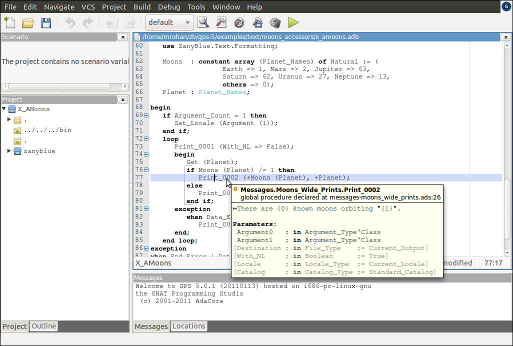

.. -*- coding: utf-8 -*-
   Copyright © 2016, Michael Rohan <mrohan@zanyblue.com>
   All rights reserved.

Example Using Accessor Functions
--------------------------------

The style of message generation using a facility string, key string and
message arguments opens an application up to the risk of a mis-match between
the expected arguments for a message and the supplied arguments (possibly
causing the ZanyBlue exceptions ``No_Such_Argument_Error`` or
``No_Such_Key_Error`` to be raised).  It is also possible to silently, in
the sense the compiler does not fail to compile, introduce errors by
accidentally mis-spelling a facility or key value (again possibly causing the
exceptions ``No_Such_Facility_Error`` or ``No_Such_Key_Error`` to raised).

For an Ada application, where the compile time detection of errors is an
expectation.  This situation is not ideal.  To overcome this, the ZanyBlue
message compiler utility can generate accessor packages for the compiled
facilities.  These packages define functions and procedures for each key in
the facility with a list of arguments matching the expected number of
arguments.  This allows the Ada compiler to perform checks on the references
to messages of ZanyBlue-ised applications.

The ``zbmcompile`` utility generates three major classes of accessor
packages (when the ``-a`` option is given):

#. Accessor functions which return the localized formatted message for
   a message key.  There are two accessor function packages generated:

   * A package for functions with return typed of ``Wide_String``.
   * A package for functions with return typed of ``String``
     (the standard Wide Strings are encoding using the encoding
     schema defined by the locale, the default being UTF-8 encoding).
     See :ref:`zb-text-encoding` for more information on encodings.

   In both cases, the functions generated are named by using message key
   prefixed with the string ``Format_``.  This requires message
   keys, when prefixed with ``Format_`` be valid Ada identifier.

#. Accessor that print the localized formatted message similar to the
   standard ``Put_Line`` routines.  There are two styles of routines
   generated:

   * Routines that use the standard ``Ada.Wide_Text_IO`` routines to print
     the formatted messages.
   * Routines that convert the ``Wide_String`` to ``String`` using the
     locale encoding and print this encoded string using Ada's ``Stream_IO``
     routines.

#. Accessor procedures which raise an exception with a localized formatted
   message (similar to the standard ``Raise_Exception`` procedure but extended
   to allow message arguments).  The procedures names generated prefix the
   message key with the string ``Raise_``.

Normally, the narrow accessors should be used instead of the wide accessors
as these support the user's encoding.

These accessor packages are generated for each facility compiled and are
created as child packages of the command line package name.

As an example, reworking the moons example in terms of the safer accessor
functions, the code would be, e.g., for the message that prints the number
of moons for a planet, using the generated wide print routine:

.. code-block:: ada

    with Messages.Moons_Wide_Prints;
    ...
    Print_0002 (+Moons (Planet), +Planet));

Here, the compiled messages are generated to the ``Messages`` package
and the accessor packages are child packages of it.

For this accessor example, the ``zbmcompile`` utility must be used with
the ``-a`` command line option to generate the accessor packages and
the target parent package is given as ``Messages``::

   $ zbmcompile -a -i -v Messages Moons
   This is ZBMCompile, Version 1.3.0 BETA (r3009M) on 6/20/16 at 1:59 AM
   Copyright (c) 2009-2016, Michael Rohan.  All rights reserved
   Loaded 25 messages for the facility "Moons" (4 locales)
   Performing consistency checks for the facility "Moons"
   Performing consistency checks for the accessor package generation
   Loaded 1 facilities, 7 keys, 4 locales and 25 messages
   Loaded total 829 characters, stored 829 unique characters, 0% saving
   Wrote the spec "Messages" to the file "./messages.ads"
   Wrote the body "Messages" to the file "./messages.adb"
   Generated accessor package spec "Messages.Moons_Exceptions" to "./messages-moons_exceptions.ads"
   Generated accessor package body "Messages.Moons_Exceptions" to "./messages-moons_exceptions.adb"
   Generated accessor package spec "Messages.Moons_Strings" to "./messages-moons_strings.ads"
   Generated accessor package body "Messages.Moons_Strings" to "./messages-moons_strings.adb"
   Generated accessor package spec "Messages.Moons_Wide_Strings" to "./messages-moons_wide_strings.ads"
   Generated accessor package body "Messages.Moons_Wide_Strings" to "./messages-moons_wide_strings.adb"
   Generated accessor package spec "Messages.Moons_Prints" to "./messages-moons_prints.ads"
   Generated accessor package body "Messages.Moons_Prints" to "./messages-moons_prints.adb"
   Generated accessor package spec "Messages.Moons_Wide_Prints" to "./messages-moons_wide_prints.ads"
   Generated accessor package body "Messages.Moons_Wide_Prints" to "./messages-moons_wide_prints.adb"
   ZBMCompile completed on 6/20/16 at 1:59 AM, elapsed time 0:00:00.124

The minor difference in the naming of the properties files should also be
noted: for the example in the previous section, the files, and hence the
facility, were all lower case.  Here, the base file name is ``Moons``.
This allow the generated Ada packages to have the more expected name
``Moons_Wide_Strings``.

Since the messages are now, in a sense, handled by the Ada compiler, IDE's,
e.g., GPS, will display the message text (the generated packages include the
message text, with markers explained later).  The accessor display in GPS
for the example message above is given in following image:

The keys used for the messages in this example are simple numeric style
strings.  The GPS IDE will also display the base language text and
the number of arguments expected for accessors as the generated Ada code
includes this text as a comment.
