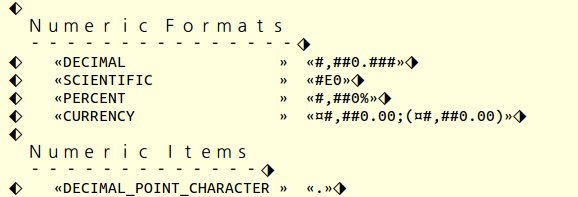
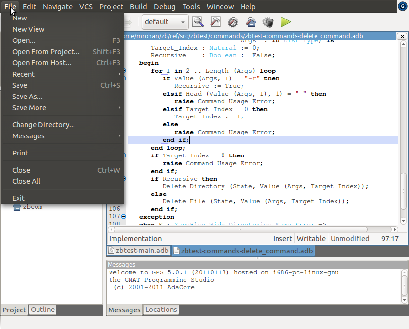
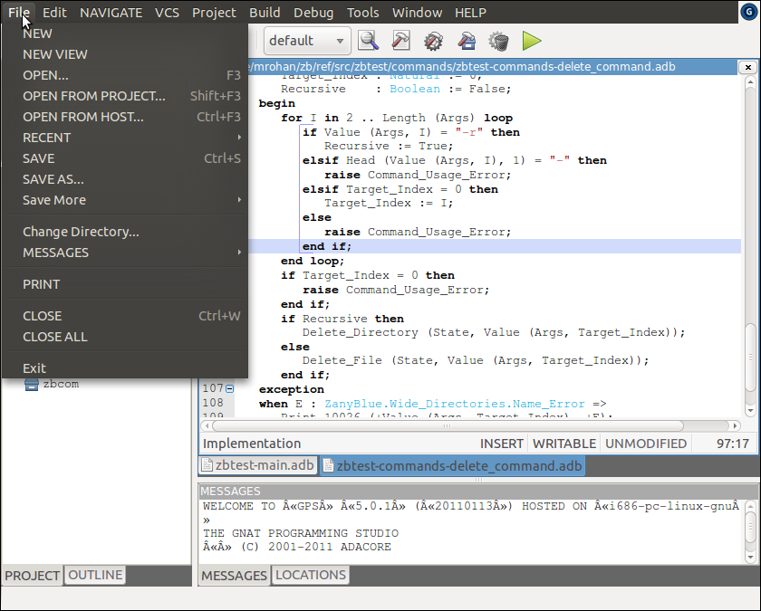

.. -*- coding: utf-8 -*-
   Copyright © 2016, Michael Rohan <mrohan@zanyblue.com>
   All rights reserved.

.. _zb-text-pseudo-translation:

Pseudo Translations
-------------------

One of the easiest mistakes to make with an internationalize application is
to include hard-coded strings, i.e., not externalize the message text into
a ``.properties`` file.  One technique to detect hard-coded strings
is to generate a pseudo translation in a test locale and test the application.
This requires "translation" of a ``.properties`` file into a pseudo
locale (the choice is normally Swahili in Kenya, i.e., ``sw_KE``) and
rebuild of a test application with the pseudo translations included.

ZanyBlue adopts a different approach and includes psuedo translation as
part of the library rather than an after the fact exercise.  The pseudo
translation support built into the library support the translation of
messages using simple wide character to wide character replacement, e.g.,
replace all ASCII character with their uppercase equivalents.  Each message
is further highlighted using start and end of message marker characters,
the left and right diamond characters.  Additionally, embedded arguments
are surrounded by French quote characters.

To enable the built-in pseudo translations, the catalogs procedure

.. code-block:: ada

   procedure Enable_Pseudo_Translations (Catalog : Catalog_Type;
                                         Mapping : Pseudo_Map_Vector);

can be used.  The ``Mapping`` argument gives the character to character
mapping that should be used in addition to the message and argument marking
of the pseudo translation.

The mappings defined by the ZanyBlue library are:

* ``Null_Map`` which preserves the message text but includes
  the start and end of messages and arguments.

* ``Uppercase_Map`` in addition to the start and end markers
  for messages and arguments, convert the message text to upper
  case (applies only to ASCII characters).

* ``Lowercase_Map`` in addition to the start and end markers
  for messages and arguments, convert the message text to lower
  case (applies only to ASCII characters).

* ``Halfwidth_Forms_Map`` in addition to the start and end markers
  for messages and arguments, convert the message text to the
  halfwidth forms for Latin alphabetic and numeric characters.

* ``Enclosed_Alphanumeric_Map`` in addition to the start and end
  markers for messages and arguments, convert the message text to the
  enclosed alphanumeric forms for Latin alphabetic characters.

**Note**: The halfwidth forms and enclosed alphanumeric mappings
require the appropriate fonts be installed.

In addition to changing the characters used for the message, the Unicode
character ``Diamond with left half black`` (U+2816) is prefixed and ``Diamond
with right half black`` is suffixed.  This allow the visual determination
of where message strings begin and end.  A relatively common programming
error is to generate a message by concatenate a set of sub-messages.  This
is apparent in a psuedo translated view of the application.

Normal argument handling occurs for pseudo translated messages and the
values are substituted into the message string.  The text of the values are
not modified by psuedo translation.  Value are, however, delimited by
French quotes (guillemets, chevrons).  The following figure
shows the output of the \texttt{zbinfo} example application with
half width psuedo translation enabled.  As can be seen from the message
delimiters, the header ``Numeric Formats`` is a multi-line messages and
is displayed using the half width font.  The Decimal, Scientific, etc,
values are formatted arguments (as can be seen from the chevrons surrounding
the values and are not displayed using the half width font.

The example applications support pseudo translation via the \verb|-x|
options.

The GPS example patches enable pseudo translation for GPS via the command
line options ``--pseudo=`` *val*, where *val* is one of ``u`` (upper),
``l`` (lower), ``h`` (halfwidth) and ``e`` (enclosed).  When halfwidth or
enclosed mappings are used, the ``linkage`` between the standard menu item
names and the localized names is lost and additional menu items are created.
The following figures show screenshots of a patched GPS:

.. image:: images/gps-enclosed.png
